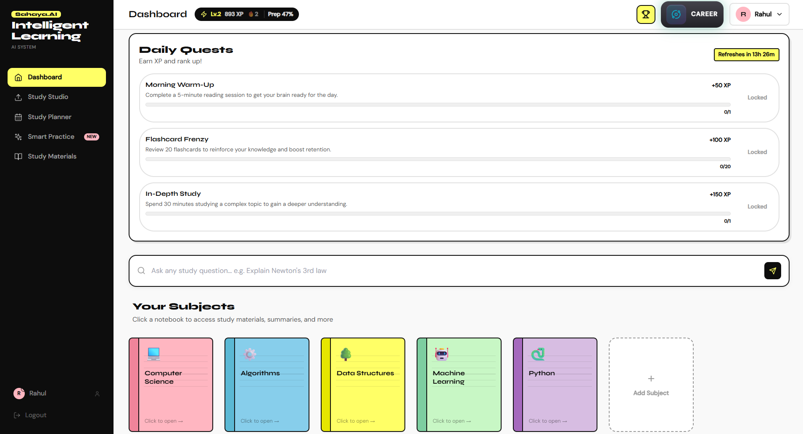
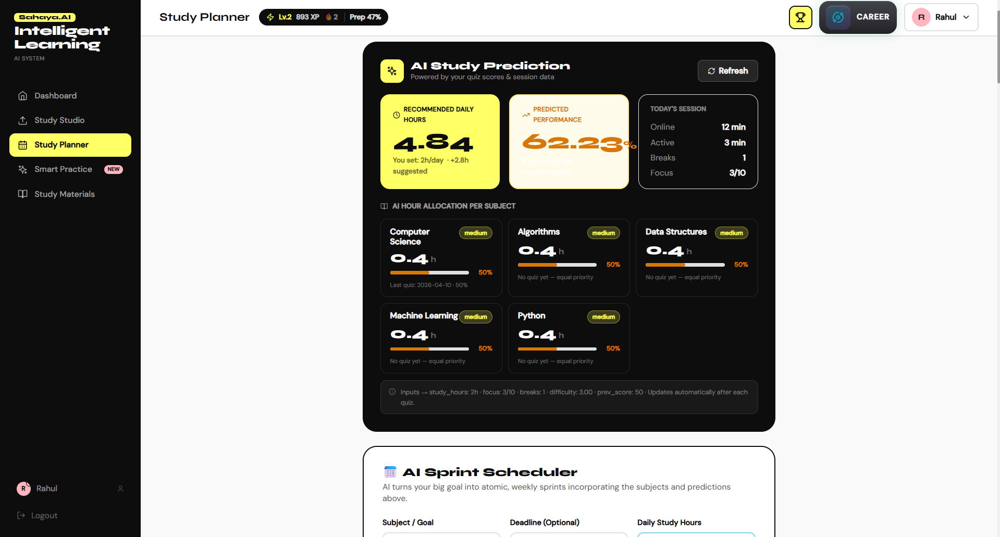
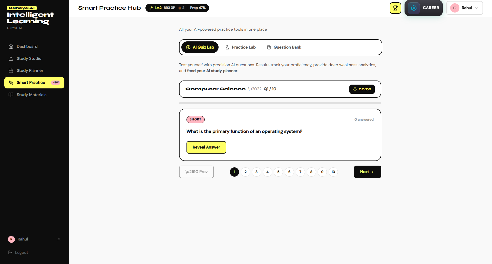
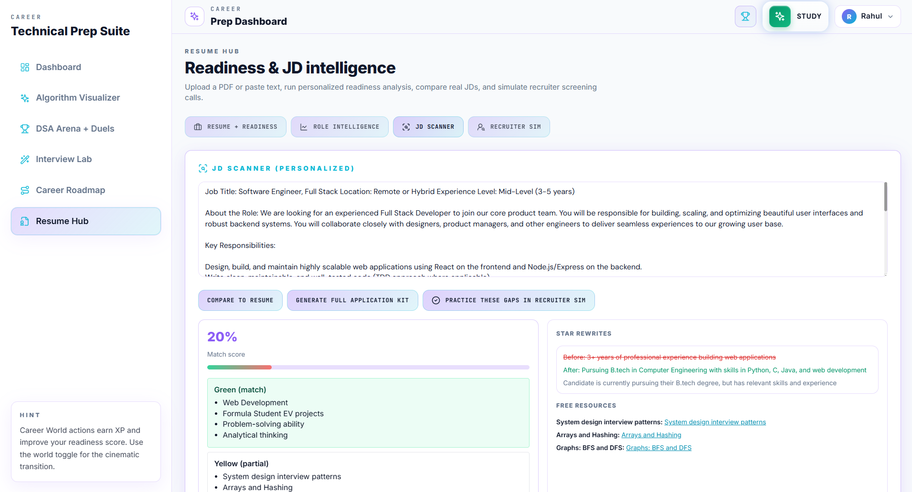
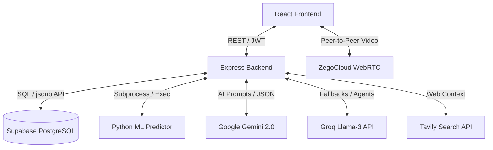
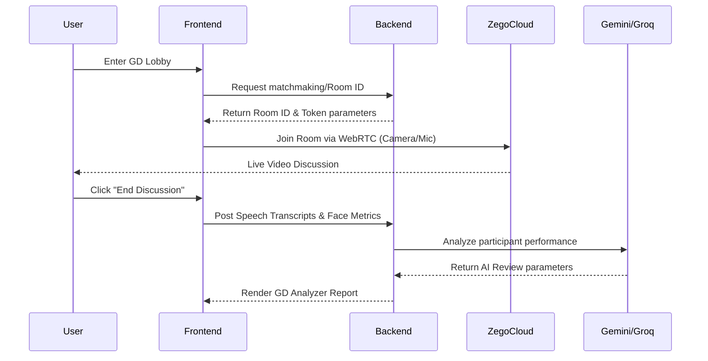

<div align="center">
  
  # SAHAYA.AI — Intelligent Learning & Career System
  
  <p>
    An end-to-end, AI-powered platform integrating adaptive studying, career preparation, real-time mock interviews, and robust gamification. Built for students who want to study smarter, not harder.
  </p>

  <div>
    
    
    
    
  </div>
</div>

<br />

## 🌟 Prototype Gallery

*(Add your high-resolution prototype screenshots to the `docs/images/` folder to make this gallery shine!)*

| Dashboard | Study Planner |
| :---: | :---: |
|  |  |
| **Problem Arena (Monaco + AI)** | **Resume Hub (JD Scanner)** |
|  |  |

---

## 🚀 Core Features

### 📚 Study World
- **Smart Upload Hub:** Upload PDFs, text, or YouTube URLs and let AI generate structured lessons, flashcards, a quiz bank, and practice problems in an instant.
- **Intelligent Study Companion:** Daily time-boxed study tasks, conceptual explainers, targeted practice questions with deep feedback, and auto-generated flashcards.
- **Adaptive Practice Hub:** Contains adaptive quizzes that generate explanations for wrong answers, and an Exam Simulator that generates specific revision plans.
- **AI Timetable Prediction:** Machine-learning-backed recommendations for study hour allocation.

### 💼 Career World
- **Problem Arena:** A fully integrated Monaco code editor to practice DSA (Data Structures & Algorithms). Features a 3-tier AI hint ladder (Nudge → Approach → Full Walkthrough) and code review powered by Gemini.
- **Live Group Discussions (GD):** A real-time, WebRTC-powered video conferencing room using **ZegoCloud** where students enter GDs. Generates AI reports of participation and speech metrics upon completion.
- **Resume Hub:** Includes a highly personalized **JD Scanner** that analyzes resumes against Job Descriptions, Readiness Intelligence, and Recruiter Simulators.
- **Career Roadmap:** Automatically generates personalized engineering paths and project milestones.

### 🎮 Gamification & Engagement
- **Daily Quests:** Auto-resetting daily missions that encourage consistent studying.
- **LevelUp System:** Overlays, XP tracking, and dynamic level scaling.
- **Global Leaderboard:** Compete globally and view top-performing students. 

---

## 🏗 System Architecture

The overarching system utilizes a monolithic Node.js runtime feeding a React SPA, connected with Supabase and multiple AI vendor integrations.



### Video Group Discussion Flow



---

## 💻 Tech Stack

**Frontend Framework:**
- React 18
- Vite
- Tailwind CSS
- Framer Motion & GSAP (for premium animations)
- Monaco Editor (Code Editing)

**Backend Architecture:**
- Node.js & Express.js
- Supabase (Postgres + `app_data_rows` implementation schema)
- Local Python scripts + Scikit-Learn for AI Predictors
- Socket.io (for specific real-time pipelines)

**WebRTC / Communications:**
- ZegoCloud Prebuilt UI Kit

**AI / Deep Tech:**
- Google Gemini (Main Orchestrator)
- Groq (High-speed Llama 3 fallback)
- Anthropic / Hugging Face (Optional specific models)
- Tavily (Search)

---

## 🛠 Local Development & Setup

### 1. Prerequisites
Ensure you have Node 18+ and Python 3.10+ installed on your machine.

### 2. Backend Setup
```bash
cd backend
npm install

# Copy the environment template
cp .env.example .env
```
Edit the `.env` file to include your **Supabase URL**, **Supabase Service Key**, and **Gemini/Groq API Keys**.

```bash
# Start the Backend (Usually http://localhost:5006)
npm run dev
```

### 3. Frontend Setup
Open a new terminal.
```bash
cd frontend
npm install

# Copy the environment template
cp .env.example .env
```
Make sure `VITE_ZEGO_APP_ID` and `VITE_ZEGO_SERVER_SECRET` are assigned inside the frontend `.env` to make Group Discussions operational.

```bash
# Start the Vite Server
npm run dev
```
Navigate to `http://localhost:5005`

---

## 🗄️ Database (Supabase) Setup

This project uses Supabase in a scalable, schema-less `app_data_rows` format to dynamically support various internal collections (users, posts, stats). 

1. Create a free project at [https://supabase.com](https://supabase.com).
2. Open **SQL Editor** → New query → paste and run the contents of `supabase/migrations/001_app_data_rows.sql`.
3. Add the **Project URL** and **service_role** API keys to the backend `.env`.
4. Run `npm run db:migrate-to-supabase` in the backend folder if you have legacy local `data/*.json` files to import!

---

## 🔒 Environment Variable Reference

### Backend (`/backend/.env`)
- `PORT`
- `JWT_SECRET`
- `SUPABASE_URL`
- `SUPABASE_SERVICE_ROLE_KEY` (Warning: Never expose this to the Frontend payload)
- `GEMINI_API_KEY`
- `GROQ_API_KEY`
- `PYTHON_BIN` (If your global python executable differs, ex: `C:\Python311\python.exe`)

### Frontend (`/frontend/.env`)
- `VITE_BACKEND_URL`
- `VITE_ZEGO_APP_ID`
- `VITE_ZEGO_SERVER_SECRET`

---

## 📄 License
This project is currently maintained as a personal/portfolio product showcasing complex integrations for AI and EdTech.

<div align="center">
  <p>Built with ❤️ for intelligent learning.</p>
</div>
